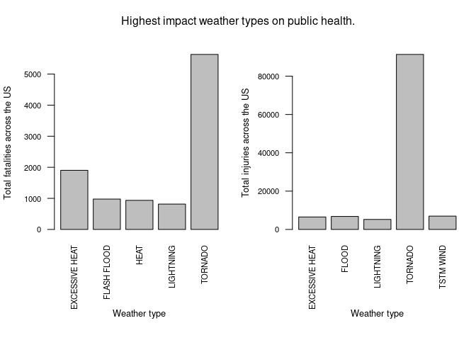
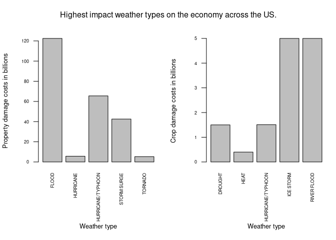

# Synopsis:

- Storms and other severe weather events can cause both public health and economic problems for communities and municipalities. Many severe events can result in fatalities, injuries, and property damage, and preventing such outcomes to the extent possible is a key concern.

- This following analysis was conducted on a dataset from the U.S. National Oceanic and Atmospheric Administration's (NOAA) storm database. This database tracks characteristics of major storms and weather events in the United States, including when and where they occur, as well as estimates of any fatalities, injuries, and property damage.

- The analysis was done to try and answer the questions :
1- Which extreme weather type is most impactful on the public health
2- Which extreme weather type is most impactful on the US economy

- In the analysis, I was able to determine that tornados are by far the most impactful on the public health, causing multiple injuries and fatalities across the US, and that it's even among the top 5 most impactful on properties as it causes property damages in the billions. Other than that, excessive heat has the 2nd highest number of fatalities reported, and thunderstorm wind (referred to as TSTM wind), has the 2nd highest number of injuries. While floods and hurricane/typhoons cause the most property damage, and ice storms, and river flood cause the most crop damage.

# Data Processing:

## 1) Loading the data:

- First we load in the dplyr library.


```r
library(dplyr)
```

```
## 
## Attaching package: 'dplyr'
```

```
## The following objects are masked from 'package:stats':
## 
##     filter, lag
```

```
## The following objects are masked from 'package:base':
## 
##     intersect, setdiff, setequal, union
```

- Then we read in the data in a new variable "stormData".


```r
stormData = read.csv("repdata_data_StormData.csv.bz2")
```

## 2) Preparing the data for analyzing the impact on public health:

-   Now, as we are interested in results impacting the entire US, for each event type, we can use "dyplr" to group the data by the "EVTYPE" column as that will be necessary for the upcoming summarizing steps.


```r
stormGrouped = group_by(stormData,EVTYPE)
```

-   Next, from the dataset, it seems public health is referred to in two columns, those being "FATALITIES", and "INJURIES". My idea to determine the most impactful weather events on public health, was to first create two new variables, "fTotal" and "iTotal" which are the sums for "stormGrouped" by fatalities, and by injuries respectively.


```r
fTotal = summarize(stormGrouped, totalFatalities = sum(FATALITIES))
iTotal = summarize(stormGrouped, totalInjuries = sum(INJURIES))
```

## 3) Preparing the data for analyzing the impact on US economy:

-   Here, we will again group the data by "EVTYPE", but we will also add "PROPDMGEXP" which as per the reference documentation, has mention of the exact amount referred to in "PROPDMG" (property damage costs), being represented as K = thousand, M = million, and B = billion, etc...

-   The same will be done with "CROPDMGEXP" and "CROPDMG" (crop damage costs).


```r
stormGroupedProp = group_by(stormData,EVTYPE, PROPDMGEXP)
stormGroupedCrop = group_by(stormData,EVTYPE, CROPDMGEXP)
```

-   The two grouped sets can then be summarized by the sum of costs of damages as such.


```r
sumPropDMG = summarize(stormGroupedProp, totalDamageCost = sum(PROPDMG))
```

```
## `summarise()` has grouped output by 'EVTYPE'. You can override using the
## `.groups` argument.
```

```r
sumCropDMG = summarize(stormGroupedCrop, totalDamageCost = sum(CROPDMG))
```

```
## `summarise()` has grouped output by 'EVTYPE'. You can override using the
## `.groups` argument.
```

-   Then we can arrange the two groups by the "totalDamageCost" column.


```r
sortedProp = arrange(sumPropDMG, desc(totalDamageCost))
sortedCrop = arrange(sumCropDMG, desc(totalDamageCost))
```

# Results:

## 1) Analyzing the impact of different weather types on public health:

-   Now, as we want to know the most impactful weather types. I organized both groups by the column representing the total number, and reported the top 5.


```r
head(arrange(fTotal, desc(totalFatalities)), 5)
```

<div data-pagedtable="false">
  <script data-pagedtable-source type="application/json">
{"columns":[{"label":["EVTYPE"],"name":[1],"type":["chr"],"align":["left"]},{"label":["totalFatalities"],"name":[2],"type":["dbl"],"align":["right"]}],"data":[{"1":"TORNADO","2":"5633"},{"1":"EXCESSIVE HEAT","2":"1903"},{"1":"FLASH FLOOD","2":"978"},{"1":"HEAT","2":"937"},{"1":"LIGHTNING","2":"816"}],"options":{"columns":{"min":{},"max":[10]},"rows":{"min":[10],"max":[10]},"pages":{}}}
  </script>
</div>

```r
head(arrange(iTotal, desc(totalInjuries)), 5)
```

<div data-pagedtable="false">
  <script data-pagedtable-source type="application/json">
{"columns":[{"label":["EVTYPE"],"name":[1],"type":["chr"],"align":["left"]},{"label":["totalInjuries"],"name":[2],"type":["dbl"],"align":["right"]}],"data":[{"1":"TORNADO","2":"91346"},{"1":"TSTM WIND","2":"6957"},{"1":"FLOOD","2":"6789"},{"1":"EXCESSIVE HEAT","2":"6525"},{"1":"LIGHTNING","2":"5230"}],"options":{"columns":{"min":{},"max":[10]},"rows":{"min":[10],"max":[10]},"pages":{}}}
  </script>
</div>

-   We can see that the top five in "fTotal" and "iTotal" have some common events, with tornados being the most impactful in both cases, and then excessive heat, and lightning being also repeated names.

-  The below plot shows the distribution of the fatality and injury counts per weather type for the top 5 weather types previously summarized.


```r
par(mfrow = c(1,2), mar = c(8,4,4,1), oma = c(0,0,0,0), cex.axis = 0.7, cex.lab = 0.8)
barplot(head(arrange(fTotal, desc(totalFatalities)), 5)$totalFatalities~head(arrange(fTotal, desc(totalFatalities)), 5)$EVTYPE, xlab = "", ylab = "Total fatalities across the US", las = 2)

title(xlab = "Weather type", line = 5.5)

barplot(head(arrange(iTotal, desc(totalInjuries)), 5)$totalInjuries~head(arrange(iTotal, desc(totalInjuries)), 5)$EVTYPE, xlab = "", ylab = "Total injuries across the US", las = 2)
mtext("Highest impact weather types on public health.", side = 3, line = -2, outer = TRUE)

title(xlab = "Weather type", line = 5.5)
```

<!-- -->

## 2) Analyzing the impact of different weather types on US economy:

- From the data, we can see this time that the top 5 most impactful weather types for both property and crop damages are mostly unrelated, with only hurricane/typhoon being a common category, and tornadoes again showing up as a major issue causing 5.3 billion worth of property damage.

- Only the top five results will be reported again, after subsetting the data by "B" to only see the most costly damages, which are in the billions.


```r
head(sortedProp[sortedProp$PROPDMGEXP=="B",], 5)
```

<div data-pagedtable="false">
  <script data-pagedtable-source type="application/json">
{"columns":[{"label":["EVTYPE"],"name":[1],"type":["chr"],"align":["left"]},{"label":["PROPDMGEXP"],"name":[2],"type":["chr"],"align":["left"]},{"label":["totalDamageCost"],"name":[3],"type":["dbl"],"align":["right"]}],"data":[{"1":"FLOOD","2":"B","3":"122.50"},{"1":"HURRICANE/TYPHOON","2":"B","3":"65.50"},{"1":"STORM SURGE","2":"B","3":"42.56"},{"1":"HURRICANE","2":"B","3":"5.70"},{"1":"TORNADO","2":"B","3":"5.30"}],"options":{"columns":{"min":{},"max":[10]},"rows":{"min":[10],"max":[10]},"pages":{}}}
  </script>
</div>

```r
head(sortedCrop[sortedCrop$CROPDMGEXP=="B",], 5)
```

<div data-pagedtable="false">
  <script data-pagedtable-source type="application/json">
{"columns":[{"label":["EVTYPE"],"name":[1],"type":["chr"],"align":["left"]},{"label":["CROPDMGEXP"],"name":[2],"type":["chr"],"align":["left"]},{"label":["totalDamageCost"],"name":[3],"type":["dbl"],"align":["right"]}],"data":[{"1":"ICE STORM","2":"B","3":"5.00"},{"1":"RIVER FLOOD","2":"B","3":"5.00"},{"1":"HURRICANE/TYPHOON","2":"B","3":"1.51"},{"1":"DROUGHT","2":"B","3":"1.50"},{"1":"HEAT","2":"B","3":"0.40"}],"options":{"columns":{"min":{},"max":[10]},"rows":{"min":[10],"max":[10]},"pages":{}}}
  </script>
</div>

- The below plot shows the distribution of the property damage costs and crop damage costs per weather type for the top 5 weather types previously summarized. The numbers for both are in the billions.


```r
par(mfrow = c(1,2), mar = c(8,4,4,1), oma = c(0,0,0,0), cex.axis = 0.56, cex.lab = 0.8)
barplot(head(sortedProp[sortedProp$PROPDMGEXP=="B",], 5)$totalDamageCost~head(sortedProp[sortedProp$PROPDMGEXP=="B",], 5)$EVTYPE, xlab = "", ylab = "Property damage costs in billions", las = 2)

title(xlab = "Weather type",line = 6)

barplot(head(sortedCrop[sortedCrop$CROPDMGEXP=="B",], 5)$totalDamageCost~head(sortedCrop[sortedCrop$CROPDMGEXP=="B",], 5)$EVTYPE, xlab = "", ylab = "Crop damage costs in billions", las = 2)
mtext("Highest impact weather types on the economy across the US.", side = 3, line = -2, outer = TRUE)

title(xlab = "Weather type", line = 6)
```

<!-- -->

# Session info:


```r
sessionInfo()
```

```
## R version 4.4.0 (2024-04-24)
## Platform: x86_64-pc-linux-gnu
## Running under: Ubuntu 22.04.4 LTS
## 
## Matrix products: default
## BLAS:   /usr/lib/x86_64-linux-gnu/blas/libblas.so.3.10.0 
## LAPACK: /usr/lib/x86_64-linux-gnu/lapack/liblapack.so.3.10.0
## 
## locale:
##  [1] LC_CTYPE=en_US.UTF-8       LC_NUMERIC=C              
##  [3] LC_TIME=en_US.UTF-8        LC_COLLATE=en_US.UTF-8    
##  [5] LC_MONETARY=en_US.UTF-8    LC_MESSAGES=en_US.UTF-8   
##  [7] LC_PAPER=en_US.UTF-8       LC_NAME=C                 
##  [9] LC_ADDRESS=C               LC_TELEPHONE=C            
## [11] LC_MEASUREMENT=en_US.UTF-8 LC_IDENTIFICATION=C       
## 
## time zone: Africa/Cairo
## tzcode source: system (glibc)
## 
## attached base packages:
## [1] stats     graphics  grDevices utils     datasets  methods   base     
## 
## other attached packages:
## [1] dplyr_1.1.4
## 
## loaded via a namespace (and not attached):
##  [1] vctrs_0.6.5       cli_3.6.2         knitr_1.46        rlang_1.1.3      
##  [5] xfun_0.43         highr_0.10        generics_0.1.3    jsonlite_1.8.8   
##  [9] glue_1.7.0        htmltools_0.5.8.1 sass_0.4.9        fansi_1.0.6      
## [13] rmarkdown_2.26    evaluate_0.23     jquerylib_0.1.4   tibble_3.2.1     
## [17] fastmap_1.1.1     yaml_2.3.8        lifecycle_1.0.4   compiler_4.4.0   
## [21] pkgconfig_2.0.3   rstudioapi_0.16.0 digest_0.6.35     R6_2.5.1         
## [25] tidyselect_1.2.1  utf8_1.2.4        pillar_1.9.0      magrittr_2.0.3   
## [29] bslib_0.7.0       tools_4.4.0       cachem_1.0.8
```
